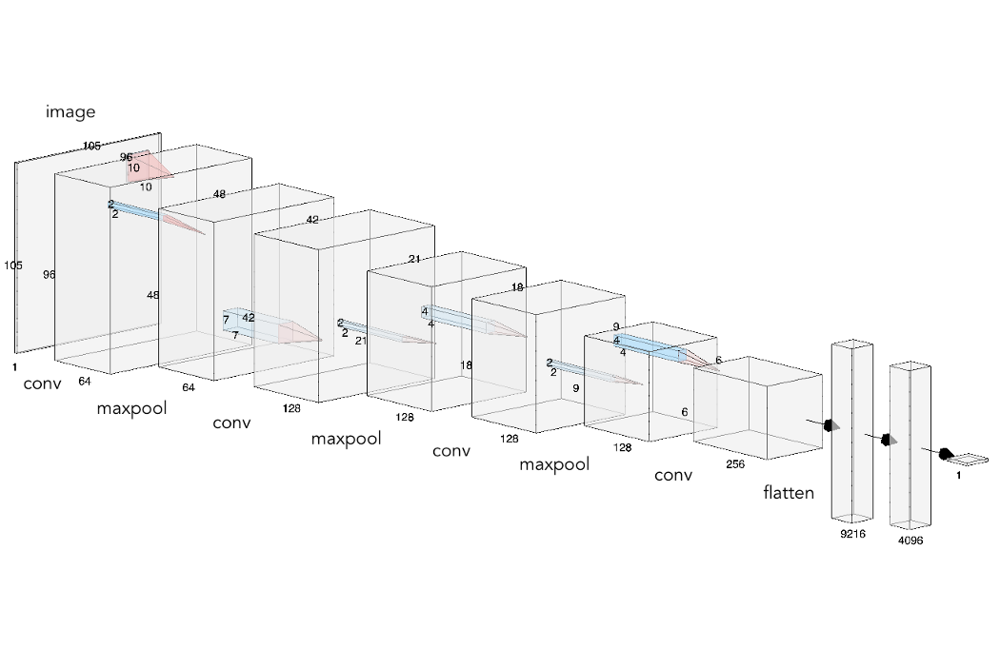
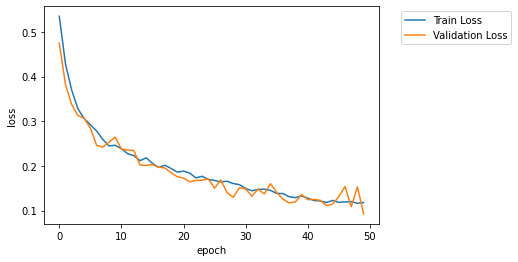
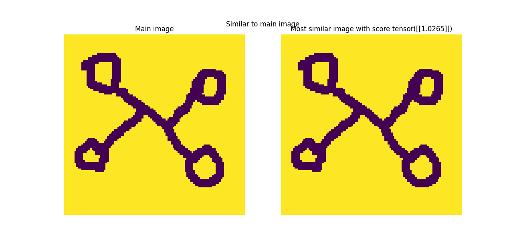
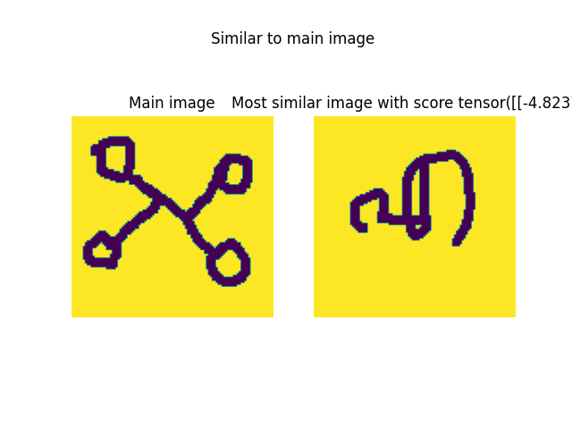

one_shot_learning
==============================

deep learning approach to solve the one-shot learning problem by using a Siamese Network

Project Organization
------------

    ├── LICENSE
    ├── Makefile           <- Makefile with commands like `make data` or `make train`
    ├── README.md          <- The top-level README for developers using this project.
    ├── data
    │   ├── external       <- Data from third party sources.
    │   ├── interim        <- Intermediate data that has been transformed.
    │   ├── processed      <- The final, canonical data sets for 
            └── images_evaluation <- Omniglot dataset
    modeling.
    │   └── raw            <- The original, immutable data dump.
    │
    ├── docs               <- A default Sphinx project; see sphinx-doc.org for details
    │
    ├── models             <- Trained and serialized models, model predictions, or model summaries
    │
    ├── notebooks          <- Jupyter notebooks. Naming convention is a number (for ordering),
    │                         the creator's initials, and a short `-` delimited description, e.g.
    │                         `1.0-jqp-initial-data-exploration`.
    │
    ├── references         <- Data dictionaries, manuals, and all other explanatory materials.
    │
    ├── reports            <- Generated analysis as HTML, PDF, LaTeX, etc.
    │   └── figures        <- Generated graphics and figures to be used in reporting
    │
    ├── requirements.txt   <- The requirements file for reproducing the analysis environment, e.g.
    │                         generated with `pip freeze > requirements.txt`
    │
    ├── setup.py           <- makes project pip installable (pip install -e .) so src can be imported
    ├── src                <- Source code for use in this project.
    │   ├── __init__.py    <- Makes src a Python module
    │   │
    │   ├── data           <- Scripts to download or generate data
    │   │   └── make_dataset.py
    │   │
    │   ├── features       <- Scripts to turn raw data into features for modeling
    │   │
    │   ├── models         <- Scripts to train models and then use trained models to make
    │   │   │                 predictions
    │   │   ├── predict_model.py
    │   │   └── train_model.py
    │   │   └── utils
    │   │       └── siamese.py
    │   │       └── util.py
    │   │
    │   └── visualization  <- Scripts to create exploratory and results oriented visualizations
    │
    └── tox.ini            <- tox file with settings for running tox; see tox.testrun.org


--------

### Architecture



### Model training



### Results





### Steps to use the repository

Step 1: Git clone the repository

    C:\>git clone https://github.com/vinodrajendran001/one_shot_learning.git


Step 2: Naviagate the cloned repo directory

    C:\one_shot_learning>


Step 3: Create a virtual environment and activate it

    C:\one_shot_learning> conda create -n oneshot python==3.8
    (oneshot)C:\one_shot_learning>

Step 4: Install all the necessary python libraries 

    (oneshot)C:\one_shot_learning> pip install -r requirements.txt

Step 5: Download the omniglot dataset and place the unzipped **images_evaluation** folder in ```data/processed/```

Step 6: Initiate the training

Once the training is completed, a model file will be generated in ```modes/``` folder.

    (oneshot)C:\one_shot_learning> python src/models/train_model.py

Step 7: Run the prediction

The aguments for prediction script are in the format mainImage and Imageset. The predcition script will generate the resulting image which is similar to mainImage from the given Imageset.

    (oneshot) C:\one_shot_learning>python src/models/predict_model.py "data/processed/images_evaluation/Angelic/character01/0965_01.png" "["data/processed/images_evaluation/Angelic/character01/0965_01.png", "data/processed/images_evaluation/Malayalam/character05/1276_03.png", "data/processed/images_evaluation/Tibetan/character14/1569_12.png"]"


### Reference:

* Koch, Gregory, Richard Zemel, and Ruslan Salakhutdinov. "Siamese neural networks for one-shot image recognition." ICML Deep Learning Workshop. Vol. 2. 2015.